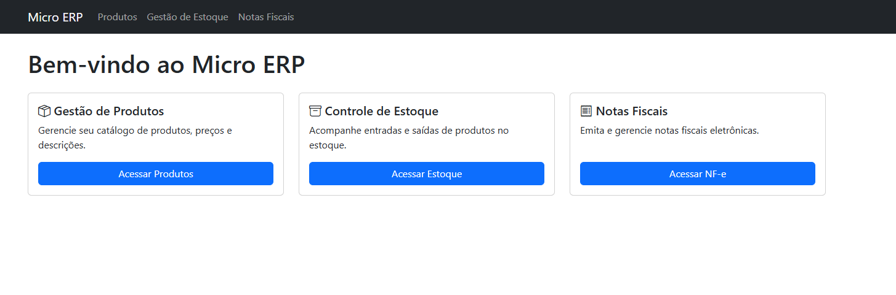

# Micro ERP - Desafio Técnico para Vaga de Programador Web



🎯 **Objetivo do Projeto**
Desenvolver um Micro ERP funcional para gestão de estoque e emissão simulada de NF-e, com foco na organização do backend, integração entre módulos e simulação de regras fiscais típicas do ambiente real de negócios, como parte do desafio técnico proposto.

> ⚠️ **Este sistema foi desenvolvido como parte de um desafio técnico para avaliação em processo seletivo de programador web. Todo o código, funcionalidades e integrações foram implementados para demonstrar domínio prático de backend, frontend, banco de dados, integrações e boas práticas de desenvolvimento.**

---

## 📋 O que o sistema faz atualmente?

O Micro ERP é um sistema web completo, com as seguintes funcionalidades já implementadas e funcionando:

### 1. Cadastro e Gestão de Produtos
- Inclusão, edição e exclusão de produtos
- Cada produto possui: código, nome, descrição, preço unitário, NCM, CFOP, unidade, quantidade mínima
- Máscaras e validações para campos fiscais (NCM, CFOP)
- Listagem de produtos com busca e filtros
- Visualização do saldo de estoque de cada produto em tempo real
- Interface moderna com modais de confirmação personalizados
- Feedback visual aprimorado para ações importantes

### 2. Gestão de Estoque
- **Entradas de estoque:**
  - Registro manual de entradas (compra, ajuste, etc.)
  - Seleção do produto, quantidade, nota fiscal e observação
  - Validação de produto e quantidade obrigatória
  - Feedback visual de sucesso após operações
- **Saídas de estoque:**
  - Saída automática ao emitir uma NF-e
  - Saída manual (ajuste, devolução, etc.)
  - Validação para não permitir saída maior que o saldo disponível
  - Confirmações visuais para operações críticas
- **Histórico de movimentações:**
  - Visualização de todas as entradas e saídas
  - Filtros por data, produto e nota fiscal
  - Saldo de estoque sempre atualizado e calculado pelas movimentações

### 3. Notas Fiscais Eletrônicas (NF-e)
- **Emissão de NF-e (simulada):**
  - Geração automática do próximo número
  - Cadastro de destinatário, itens, valores, NCM, CFOP
  - Cálculo automático de ICMS por dentro (18%)
  - Geração de XML e PDF (simulados)
  - Download de XML e PDF
- **Edição e exclusão de NF-e:**
  - Notas em rascunho podem ser editadas ou excluídas
- **Visualização detalhada:**
  - Exibe todos os dados da nota, itens, totais, ICMS embutido
  - Valores exibidos sempre já com ICMS embutido (igual ao PDF/XML)
- **Integração com estoque:**
  - Ao autorizar uma NF-e, o sistema baixa automaticamente o estoque dos produtos envolvidos

### 4. Integração entre módulos
- Produtos cadastrados são usados em estoque e NF-e
- Saída de estoque é automática ao emitir NF-e
- Saldo de estoque é exibido em todas as telas relevantes

### 5. Interface e Experiência do Usuário (UX)
- **Modais Modernos e Intuitivos:**
  - Confirmações visuais para ações importantes
  - Ícones modernos e animados
  - Mensagens claras e destacadas
  - Feedback visual imediato após operações
- **Elementos Visuais Aprimorados:**
  - Ícones Bootstrap Icons atualizados
  - Animações suaves para melhor feedback
  - Cores consistentes e significativas
  - Tipografia clara e legível
- **Confirmações de Ações:**
  - Modais personalizados para exclusão
  - Mensagens de confirmação destacadas
  - Botões com ícones intuitivos
  - Textos em negrito para ações críticas

---

## 🗂️ Estrutura do Projeto

```
micro_erp/
├── app/
│   ├── controllers/         # Regras e rotas de produtos, estoque, NF-e
│   ├── models/              # Modelos do banco de dados
│   ├── services/            # Geração de XML/PDF, simulação SEFAZ
│   ├── static/
│   │   ├── css/           # Estilos CSS modularizados
│   │   │   └── modals.css # Estilos específicos para modais
│   │   └── js/            # Scripts JS organizados por módulo
│   │       ├── produtos/   # Scripts específicos de produtos
│   │       ├── estoque/    # Scripts específicos de estoque
│   │       └── nfe/        # Scripts específicos de NF-e
│   └── templates/           # Páginas HTML (Jinja2)
├── migrations/              # Migrações do banco
├── instance/                # Banco SQLite
├── config.py                # Configurações gerais
├── requirements.txt         # Dependências do projeto
└── app.py                   # Inicialização do sistema
```

---

## 🛠️ Tecnologias Utilizadas
- Python 3.11+
- Flask, Flask-SQLAlchemy, Flask-Migrate
- SQLAlchemy
- PyNFe, zeep, reportlab
- HTML5, Bootstrap 5, JavaScript (ES6+)
- SQLite (apenas para testes)

---

## 🚀 Como Executar (Apenas para Teste)

1. Clone o repositório e acesse a pasta:
   ```bash
   git clone [url-do-repositorio]
   cd micro_erp
   ```
2. Crie e ative o ambiente virtual:
   ```bash
   python -m venv venv
   .\venv\Scripts\activate  # Windows
   source venv/bin/activate  # Linux/Mac
   ```
3. Instale as dependências:
   ```bash
   pip install -r requirements.txt
   ```
4. Inicialize o banco de dados:
   ```bash
   flask db upgrade
   # ou
   python create_db.py
   ```
5. Execute o sistema:
   ```bash
   python app.py
   ```
6. Acesse no navegador:
   - Em ambiente local: [http://localhost:5000](http://localhost:5000)
   - **Após o deploy na nuvem:** use o link fornecido pela plataforma, por exemplo: [https://seu-projeto.up.railway.app](https://seu-projeto.up.railway.app)

---

## 📝 Exemplos de Uso
- **Cadastrar Produto:** Menu Produtos > Novo Produto
- **Registrar Entrada/Saída:** Menu Gestão de Estoque > Entradas/Saídas > Nova Entrada/Saída
- **Emitir NF-e:** Menu Notas Fiscais > Nova NF-e
- **Visualizar NF-e:** Menu Notas Fiscais > Olho (Visualizar)
- **Download XML/PDF:** Menu Notas Fiscais > Botões de download

---

## 🔒 Validações e Regras
- Não permite saída de estoque maior que o disponível
- Não permite emissão de NF-e sem produtos
- Validação de campos obrigatórios em todos os formulários
- Cálculo de ICMS por dentro em todos os totais exibidos
- Máscaras e validações para campos fiscais (NCM, CFOP)

---

## 📊 Diferenciais Técnicos Utilizados

- Organização por camadas (controllers, models, services)
- Simulador de rejeição de NF-e com regras fiscais
- Cálculo fiscal de ICMS por dentro (18%)
- Integração entre módulos (produtos, estoque e NF-e)
- Geração simulada de XML/PDF de NF-e
- Scripts JS dinâmicos para manipulação dos formulários
- Boas práticas de versionamento e documentação
- CSS modularizado para melhor manutenção
- Componentes reutilizáveis (modais, alertas)
- Interface responsiva e moderna
- Feedback visual aprimorado para usuários

---

## 🚦 Cancelamento de NF-e (Diferencial)

- É possível cancelar uma NF-e já autorizada diretamente na listagem.
- Ao cancelar, o sistema devolve automaticamente o estoque dos produtos envolvidos (entrada de estoque para cada item da nota cancelada).
- O histórico de movimentações exibe essas devoluções com o status **NF cancelada** destacado em amarelo, facilitando o controle e a auditoria.

---

## ❗ Observações Importantes
- Este sistema **não** deve ser usado em produção.
- A emissão de NF-e é **simulada** (não envia notas reais para a SEFAZ).
- O objetivo é demonstrar lógica, organização, integração e domínio de conceitos de desenvolvimento web.
- O código pode ser adaptado, melhorado e expandido conforme o desafio exigir.

---

## 📚 Documentação Detalhada
Para uma documentação mais completa e detalhada do projeto, incluindo:
- Arquitetura detalhada
- Fluxos de processos
- Regras de negócio
- Auxílio de IA no desenvolvimento
- Convenções do projeto
- E muito mais...

Consulte o arquivo [`docs/DOCUMENTACAO.md`](docs/DOCUMENTACAO.md).

---

## ✨ Agradecimentos
- Equipe avaliadora
- Comunidade Flask
- Contribuidores do PyNFe 